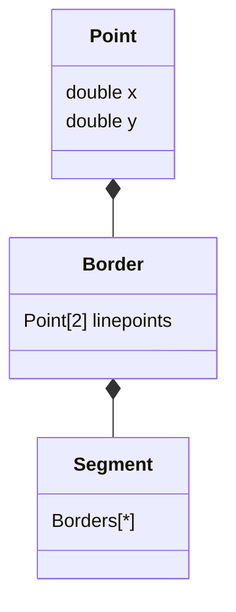

# AbstractGeometryObject
This class is abstraction of planar graph. It cosisted of objects, that in mathematical abstraction is verges, vertexses are intersection of three or more verges and borders are edges.
There we can say, that simple mathematical abstraction edge is simple line, but real borders can be as straight line, as polylines, as different types of curves. Vertexes are not interesting in saving abstraction, but is important as random argument - it can be good for describing in segmentation.

