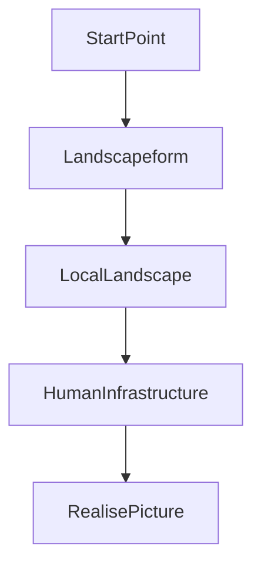
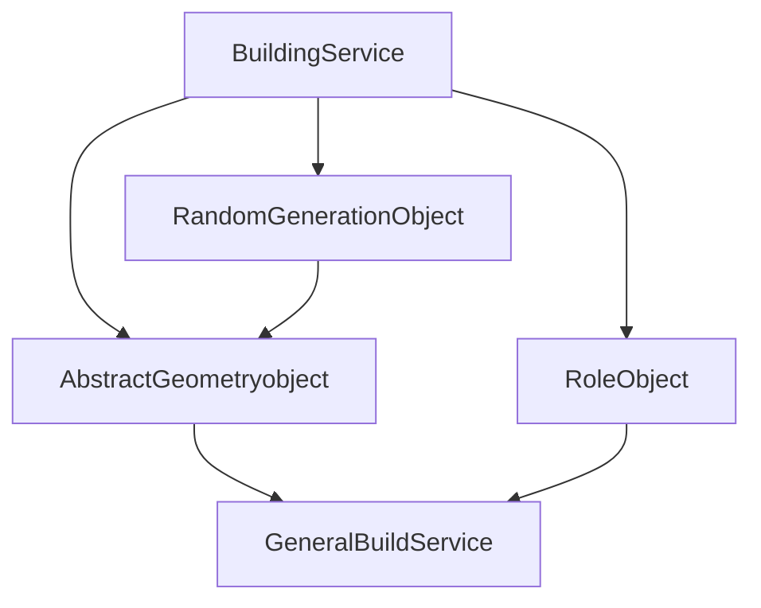

# MapMaker
Generate Map for game
Our idea will get on generate multipoligons with some roles. Maybe in little segmentations it can be looks like simple polygon clusters, but we know that it too simple variant. We can make more accurate variant with special class Border. But we should say, that first points is dividing points between localization clusters. In some abstraction map will be like planar graph with edges - 3-ple and more dimention intersection between local objects.
There forming algoritm structure:

1) In Landscapeform we will make relief segment. Mountain, fields, lakes and seas.
2) In LocalLandscape we fill in relief segments with local objects. Rivers and forrests are included.
3) In HumanInfrastructure we will man all human infrustructure. There static cities, villages and local houses will be connected with roads and bridges.
There we will divide objects to into three logical parts:
1) Abstract geometic object
2) Role of this object
3) World Builder service
4) Additional random building polyhon service.
There no intersects between sets in every stage of forming there no intersects between abstract sets until we will not draw. Only in building objects we will control form and location of objects.
